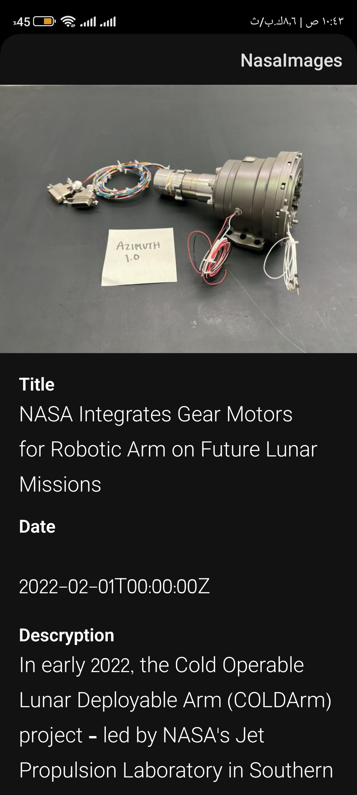

# Nasa Images App
using nasa images api

* Used in This Project
* Android Studio
* Clean Architecture and MVVM 
* Repository Pattern
* Retrofit
* Moudules
* hilt (DI)
* Sensor Manager
* Data binding
* ROOM for local database caching
* Coroutines

# Languages
* Kotlin and Java

** Images

# installing App

<a href="https://raw.githubusercontent.com/AhmedMHassaan/NasaImages/master/APK/NasaImages.apk" target="_blanc">Download<a/>
